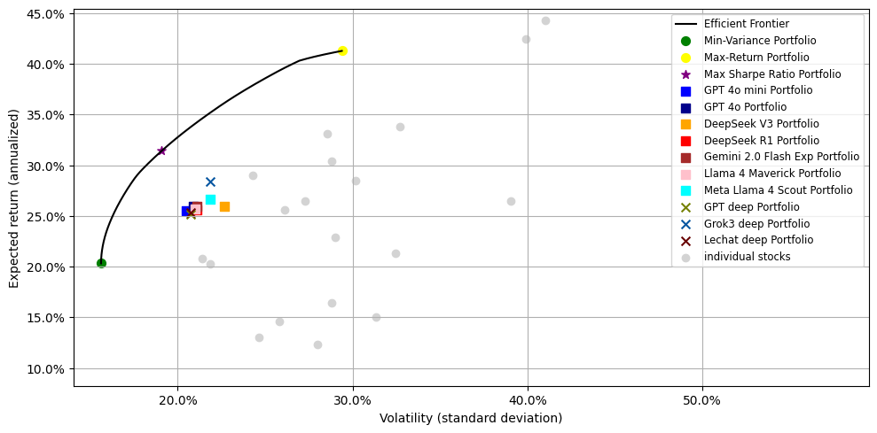
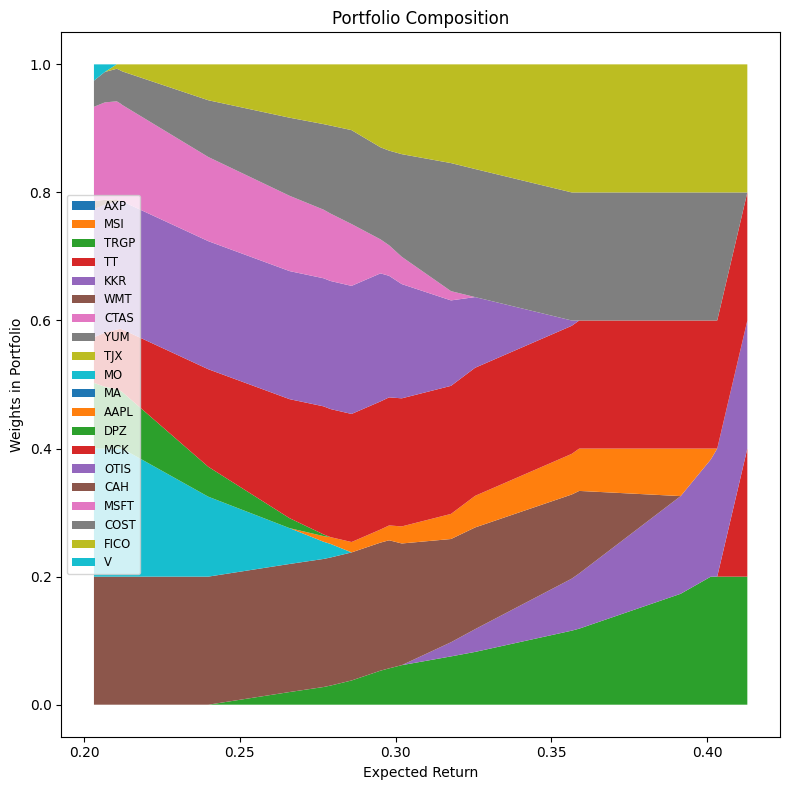
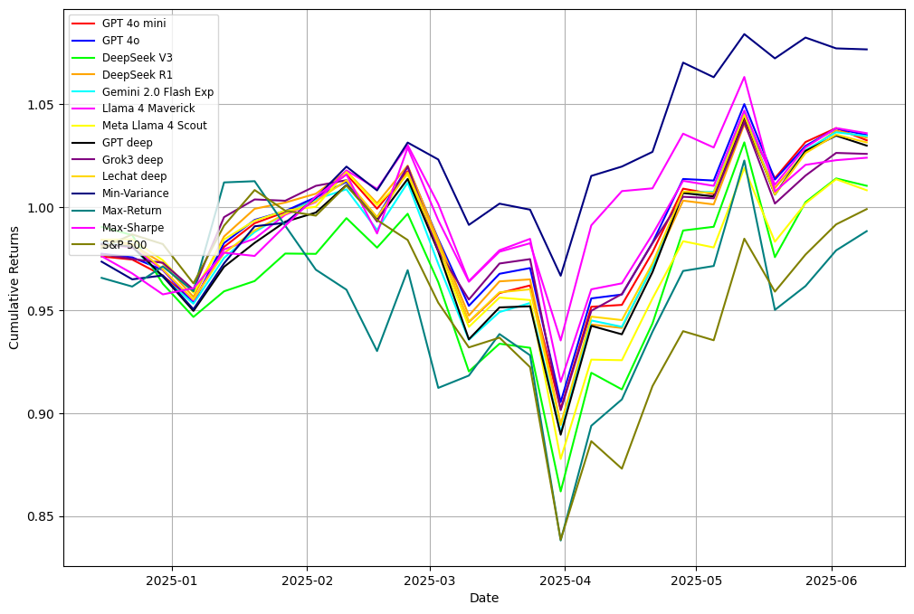

# Portfolio Optimization

<!-- omit in toc -->

## Languages

<!-- omit in toc -->
## Frameworks

<!-- omit in toc -->
## Table of Contents
- [Portfolio Optimization](#portfolio-optimization)
  - [Languages](#languages)
  - [Introduction](#introduction)
  - [Project Workflow](#project-workflow)
    - [Efficient Frontier](#efficient-frontier)
    - [Mean-Variance Portfolio Composition](#mean-variance-portfolio-composition)
    - [Test](#test)

## Introduction
This project is the final assignment for the Financial and Risk Analytics course at [BigDataLab](https://www.bigdatalab.com.ua/).

## Project Workflow
### Efficient Frontier
The project uses the following portfolios:
- Min-Variance Portfolio
- Max-Return Portfolio
- Max Sharpe Ratio Portfolio
- GPT-4o-mini Portfolio
- GPT-4o Portfolio
- DeepSeek V3 Portfolio
- DeepSeek R1 Portfolio
- Gemini 2.0 Flash-Exp Portfolio
- Llama 4 Maverick Portfolio
- Meta Llama 4 Scout Portfolio
- GPT Web Deep-Research Portfolio
- Grok3 Web Deep-Research Portfolio
- LeChat Web Deep-Research Portfolio

For diversification we used the constraint `0 ≤ weight ≤ 0.2`.  
Cardinality: 20 assets.  
Risk-free rate (for Sharpe ratio): 0.02  

### Mean-Variance Portfolio Composition
Portfolio composition for mean-variance, where:
- X - Expected Return
- Y - Weights 

### Test
- The min-variance and Sharpe ratio portfolios performed best.  
- The max-returns portfolio performed poorly, possibly due to the current geopolitical situation.  
- The neural network portfolios slightly outperform the S&P 500 benchmark.

